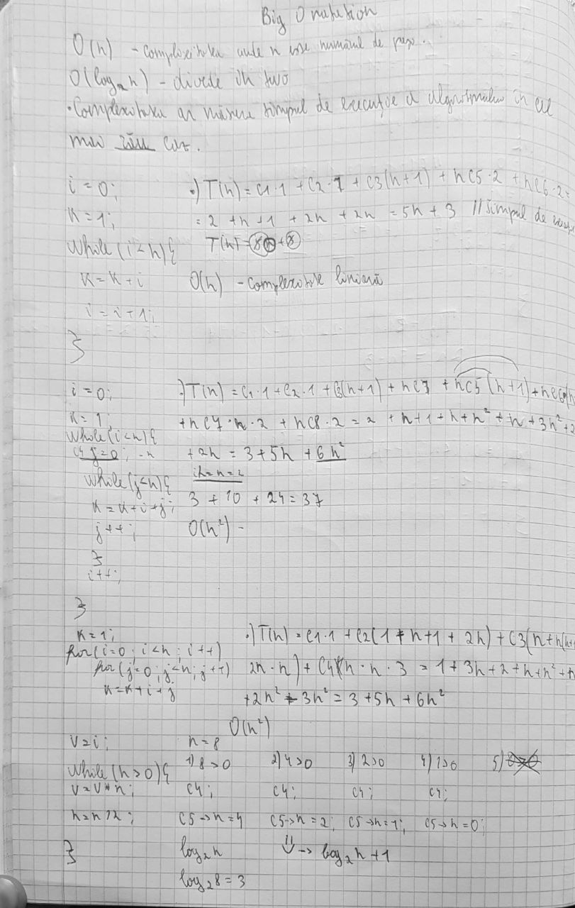

Big O is all about complexity of code execution, there are different tips of comlexity and some of them I worte in my notebook:

Also Big O is very important in analyzing the alghoritms and rate their overall power