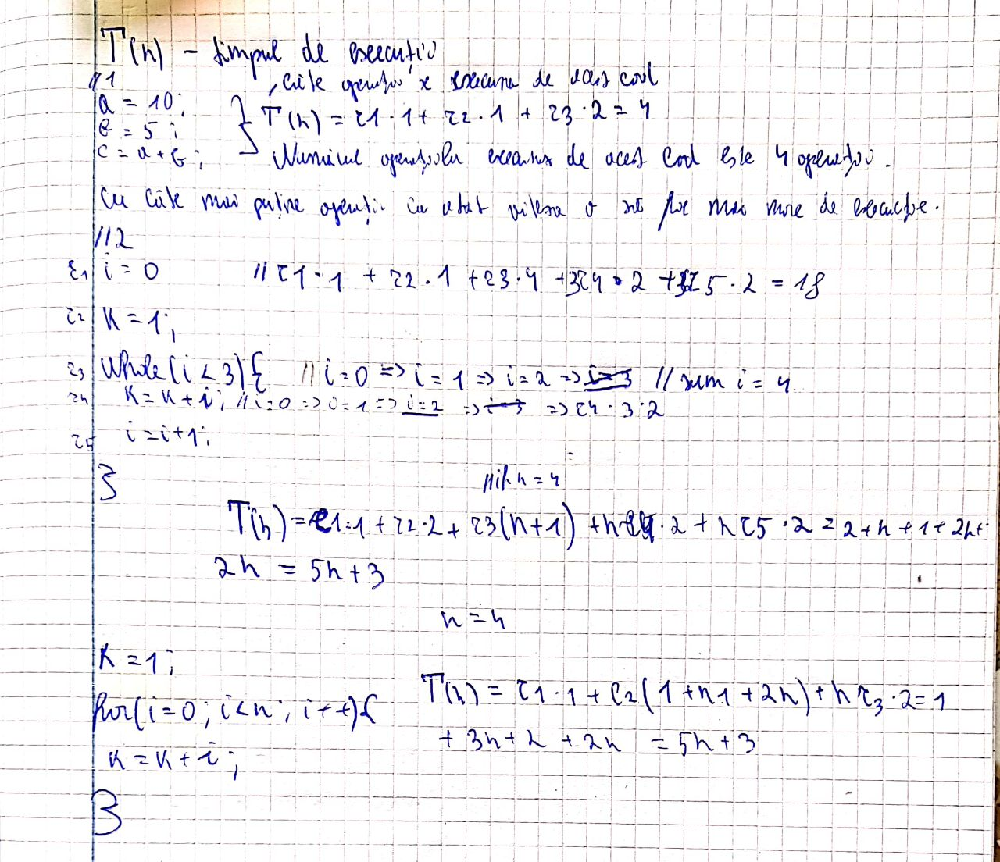

# Base notation-time of execution
T(n) - in my mind I see it T is how many operation is executed and 'n' is a number form the user or something elese.
## Example:
```
i = 0;
k = 1;
while(i<n){
    k = k + 1;
    i = i+1;
}
Time of execution here is or number of operations is: T(n)  = r1*1 + r2+1 + r3(n+1) + n*r4*2 + n*r5*2 = 2 + n + 1 + 2*n +2*n = 5 *n +1
```
### Also some useless writing in my notebook:
