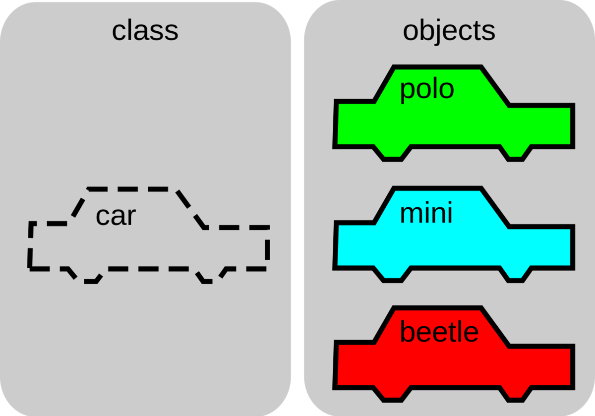
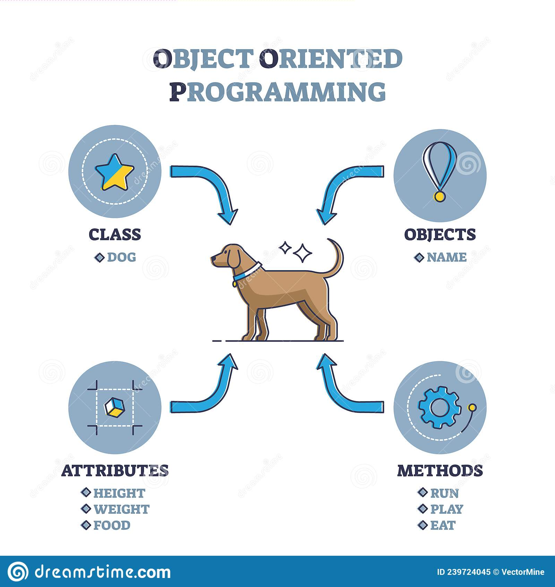

As I understand OOP is a programming paradigm based on concepts of an object.
An object can contain data and also code.
Data is atributes and code si method.

The four principles of object-oriented programming:
Abstraction
Inheritance
Encapsulation
Polymorphism

Here is what a class is:

And here is what a object of class is(prototype in class)
